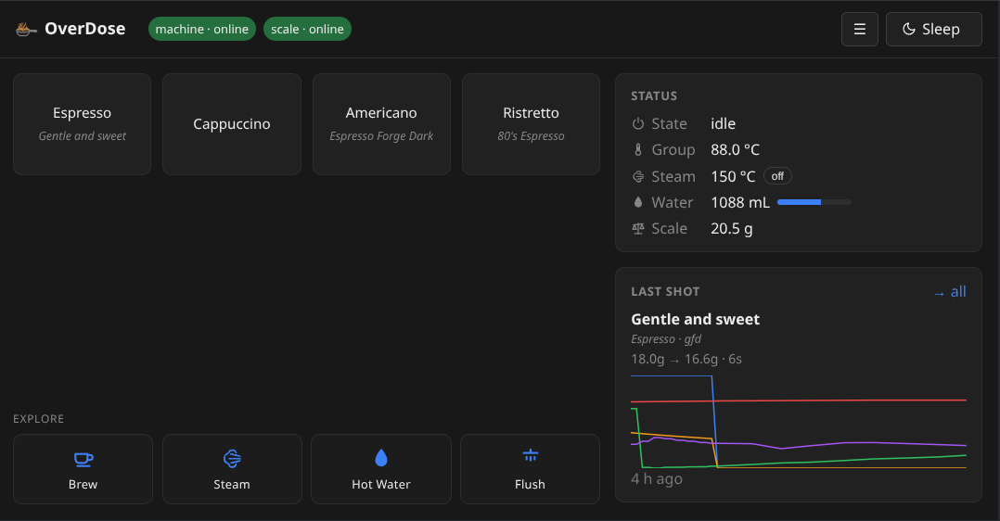
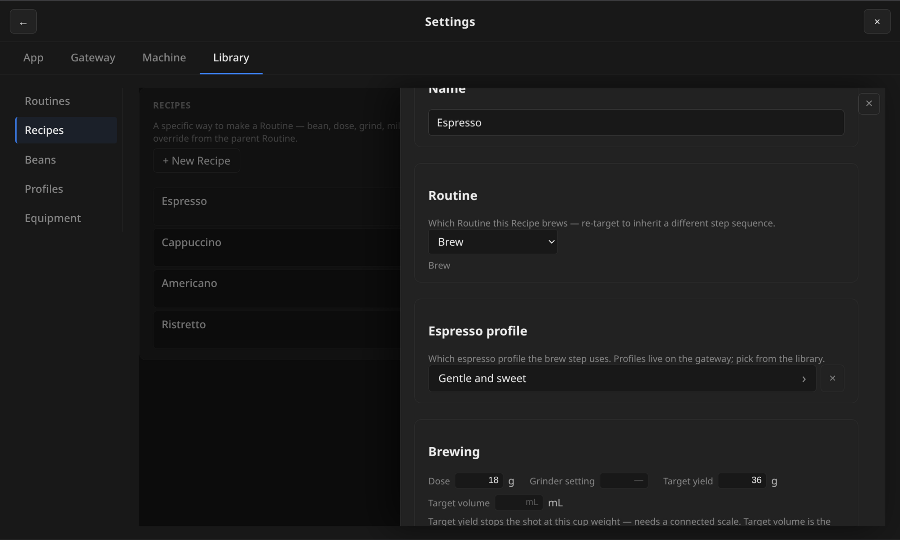
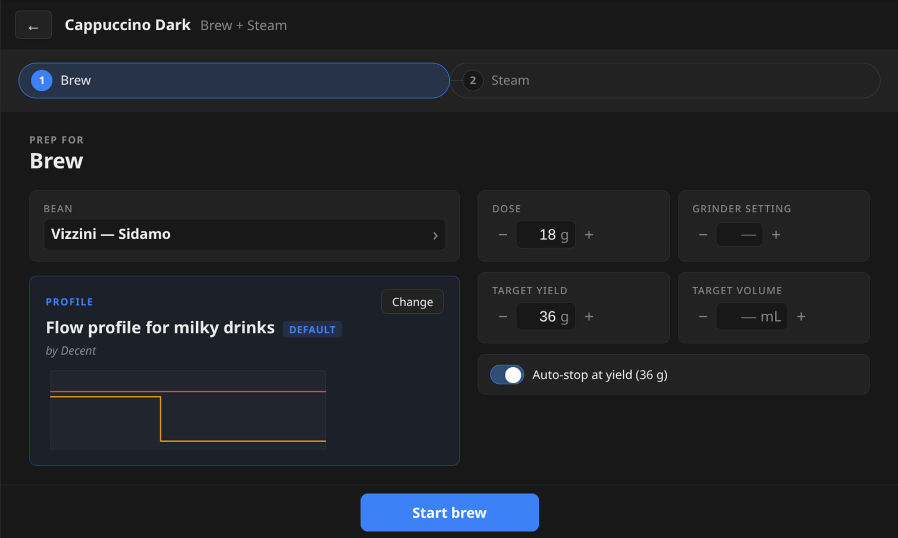
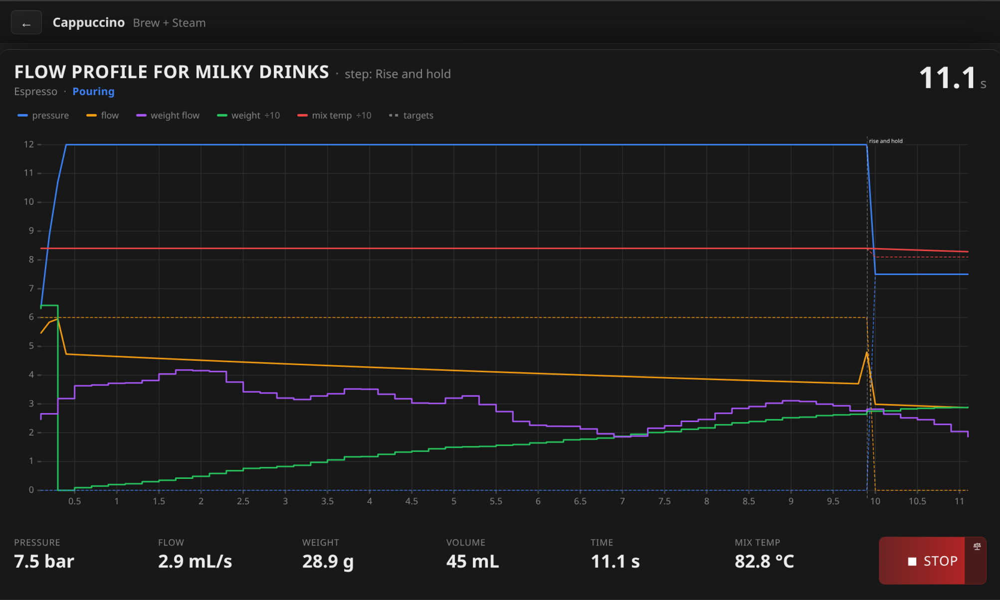
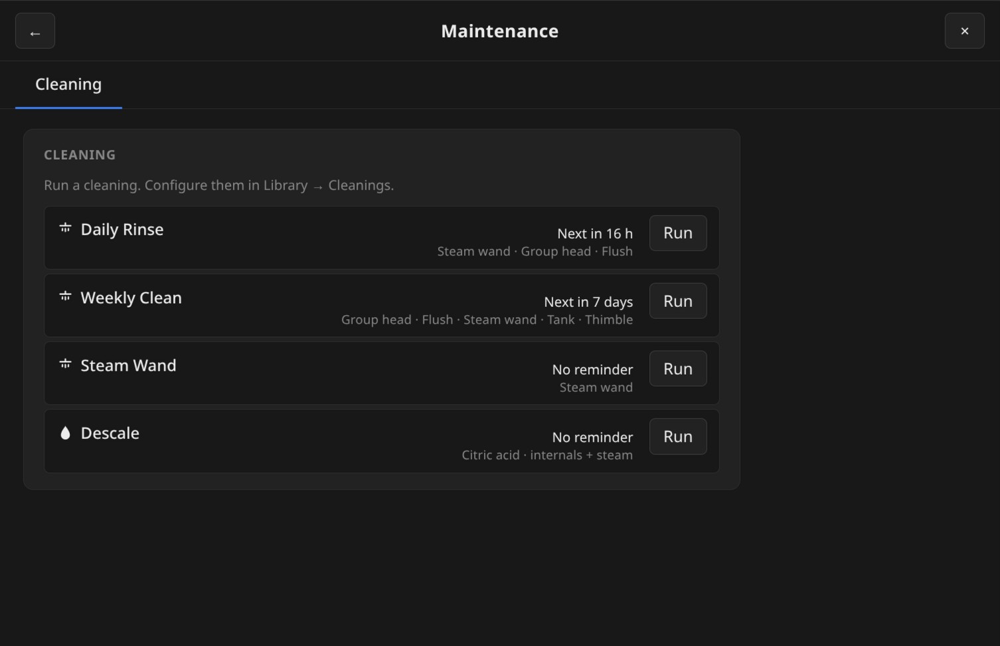
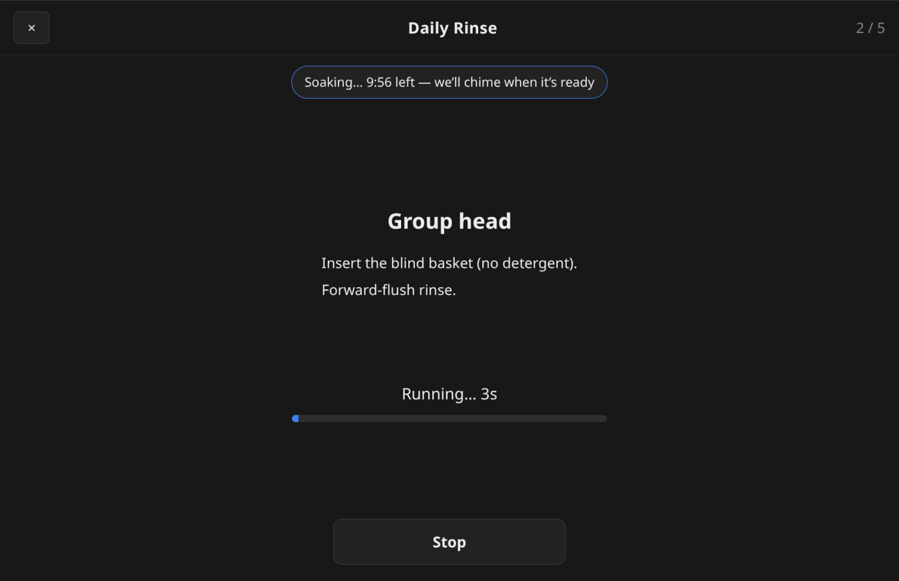
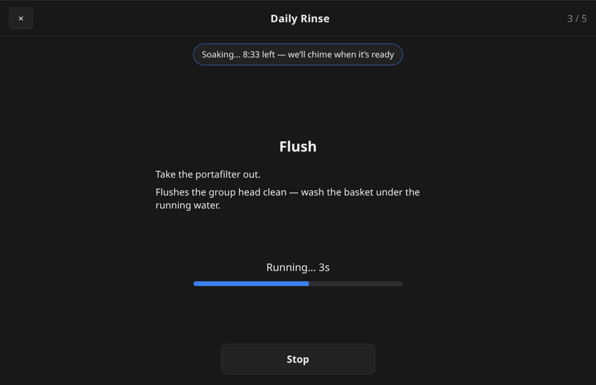
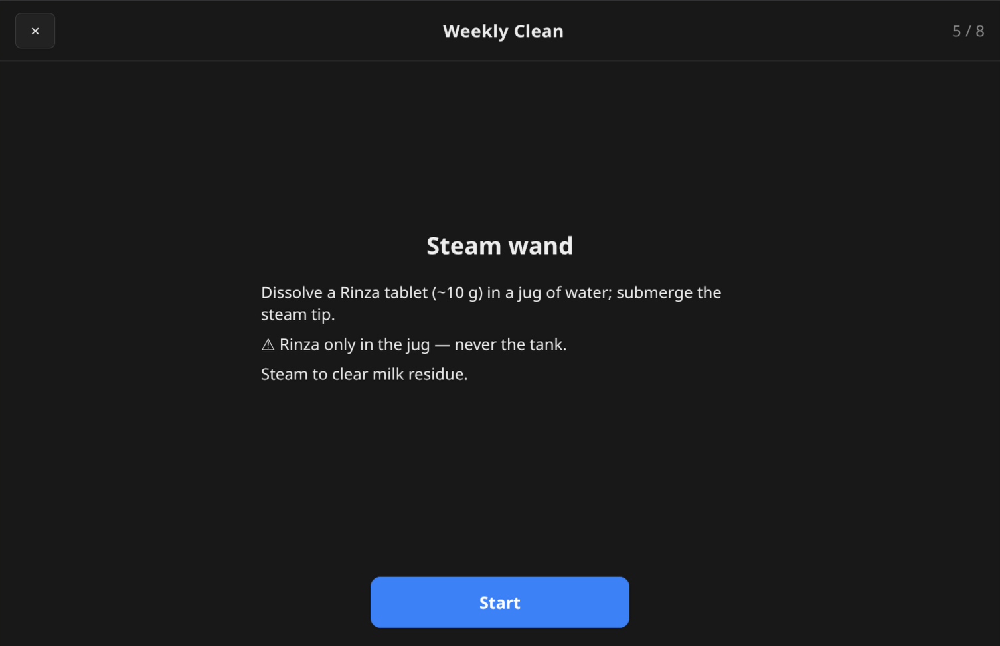

<picture>
  <source media="(prefers-color-scheme: dark)" srcset="docs/logo-lockup-dark.svg">
  
</picture>

A community skin for [Decent.app](https://github.com/tadelv/reaprime) —
the gateway that drives Decent Espresso machines. OverDose adds a
recipe-driven brewing UI, designed for the tablet on your espresso bar.

*The name is just my espresso intake, rounded down.*

> The reason it exists is simple: my own daily routine. I usually have
> three or four bags of beans open at once, each dialed in differently —
> plus the cappuccinos my family drinks, each with its own steam. Keeping
> all that in my head, or on scribbled notes, never held up. So I dial a
> new bag in with **Explore**, and once it tastes right I save it as a
> Recipe — then it's one tap to brew it the same way every time. Right now
> I keep three espresso recipes and two cappuccinos ready.

## Core design decisions

- Light and responsive
- Smooth daily flow

## Features

- Recipes store shot setup for repeatable shots
- Per-shot setting overrides
- Auto-stop by weight (with a connected scale) or volume (estimated)
- Auto-stop steam by time (configurable per pitcher)
- Two-level water warnings (soft warning + machine refill level)
- Smooth live shot view
- Guided cleaning routines with scheduled reminders
- Optional audio cues (machine-ready, sleep/wake, water, cleaning-due)
- Highly configurable

## Recipes

OverDose is built around one idea: **a great espresso is a recipe,
not just a profile.**

A profile tells the machine how to push water. A Recipe holds the
whole drink — profile, dose, grind setting, steam, hot water,
rinse — saved together and edited in one place.

Pick a recipe and OverDose shows a prep view — dose target, grind
reminder, the starting state of the machine — before you start.

Then the shot itself — pressure, flow, and weight in real time.

For drinks with milk or hot water, the shot is just the first step.
Steam follows when you're ready — manual progression keeps you in
control between phases rather than racing an auto-progressing timer.

For ad-hoc operations that don't deserve a saved recipe — warming a
cup, a quick steam wand purge, hot water for tea — the **Explore**
tray on the home screen runs the four machine operations directly.

## Cleaning & maintenance

Keeping the machine clean is part of the daily flow too, so OverDose
treats a cleaning like a recipe — a routine you set up once, then run
with step-by-step guidance. The **Maintenance** screen lists them and
flags the ones that are due.

A routine is a sequence of steps you arrange yourself: a group-head
forward-flush (with or without detergent), a plain flush, steam-wand
cleaning with Rinza, a quick steam purge, the steam-tip soak, the water
tank, the uptake thimble. Sensible defaults ship ready to use.

Run one and OverDose walks each step — what chemical goes where (and
what must never go in the tank), what to do, and a live countdown for
each machine run. Long soaks start a background timer and chime when
they're ready.

| Group head | Flush | Steam wand |
|:---:|:---:|:---:|
|  |  |  |

Give a routine a schedule — every Friday afternoon, daily, the first of
the month — and OverDose reminds you when it's due: a pill in the header
(with a chime) and a one-tap tile on the home screen.

## Using OverDose

New to the skin? **[docs/usage-story.md](docs/usage-story.md)** walks through a
day with OverDose in pictures — setting up beans and recipes, then the brew →
steam → summary flow.

## Installing OverDose

> **Note:** OverDose is a skin for the new Decent.app gateway
> ([tadelv/reaprime](https://github.com/tadelv/reaprime)), not the
> original DE1 tablet app (`de1app`). It won't load on the old app.

From **Decent.app version 0.7.5** onward, OverDose ships with the gateway — no
install needed. Just open the **Web Interface** skin selection and pick
**OverDose**. Upgrades arrive with gateway skins updates.

### Accessing OverDose from another device

If you want to open the skin from a phone or laptop on the same
network instead of the Decent.app tablet, ports **8080** (API) and
**3000** (skin host) need to be reachable. Allow them in any firewall
running on the gateway machine.

## For contributors

OverDose is SolidJS + Vite + uPlot. The dev loop runs the Decent.app
gateway in simulate mode alongside Vite's dev server.

    # terminal 1 — the gateway, with a simulated machine and scale
    cd ../reaprime
    flutter run --dart-define=simulate=machine,scale

    # terminal 2 — the skin
    npm install
    npm run dev    # http://localhost:5173

`npm run dev` proxies `/api/*` and `/ws/*` to `localhost:8080`. Point
the dev server at a real gateway on your LAN with
`GATEWAY_HOST=192.168.1.42:8080 npm run dev`.

Other commands:
- `npm run build` — type-check + production bundle to `dist/`
- `npm test` — vitest unit + component tests

## License

GPL-3.0. See [LICENSE](LICENSE).

## Thanks

- The Decent Espresso community for
  [de1app](https://github.com/decentespresso/de1app), the original DE1 client.
- [reaprime](https://github.com/tadelv/reaprime) — the gateway OverDose
  runs on.
