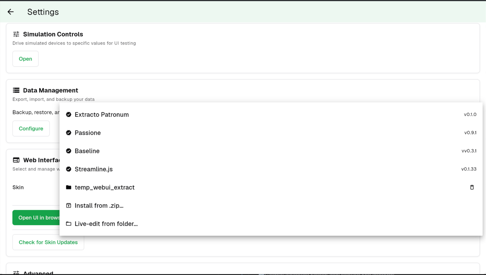

<picture>
  <source media="(prefers-color-scheme: dark)" srcset="docs/logo-lockup-dark.svg">
  
</picture>

A community skin for [Decent.app](https://github.com/tadelv/reaprime) —
the gateway that drives Decent Espresso machines. OverDose adds a
recipe-driven brewing UI, designed for the tablet on your espresso bar.

*The name is just my espresso intake, rounded down.*

> The reason it exists is simple: my own daily routine. I usually have
> three or four bags of beans open at once, each dialed in differently —
> plus the cappuccinos my family drinks, each with its own steam. Keeping
> all that in my head, or on scribbled notes, never held up. So I dial a
> new bag in with **Explore**, and once it tastes right I save it as a
> Recipe — then it's one tap to brew it the same way every time. Right now
> I keep three espresso recipes and two cappuccinos ready.

## Recipes

OverDose is built around one idea: **a great espresso is a recipe,
not just a profile.**

A profile tells the machine how to push water. A Recipe holds the
whole drink — profile, dose, grind setting, steam, hot water,
rinse — saved together and edited in one place.

Pick a recipe and OverDose shows a prep view — dose target, grind
reminder, the starting state of the machine — before you start.

Then the shot itself — pressure, flow, and weight in real time.

For drinks with milk or hot water, the shot is just the first step.
Steam follows when you're ready — manual progression keeps you in
control between phases rather than racing an auto-progressing timer.

For ad-hoc operations that don't deserve a saved recipe — warming a
cup, a quick steam wand purge, hot water for tea — the **Explore**
tray on the home screen runs the four machine operations directly.

## Installing OverDose

OverDose installs onto a running Decent.app gateway as a "skin." The
gateway has its own settings UI for managing skins — it lives outside
the skin itself, on the gateway's dashboard.

### Getting to skin settings

Skin management isn't reachable from inside OverDose. From wherever
you are:

1. Tap your browser's **back** button until you're at the Decent.app
   dashboard.
2. Open **Settings** from the dashboard.
3. Go to the **Web Interface** section.
4. Open the **Skin** dropdown — the install actions live there.

### Three ways to install

**From a zip release (recommended).** Download the latest
`overdose-vX.Y.Z.zip` from the
[Releases page](https://github.com/rotium/OverDose/releases). In the
Skin dropdown, choose **Install from .zip** and pick the file.

**From a URL.** If your gateway is reachable on the network:

    POST http://<gateway-ip>:8080/api/v1/webui/skins/install/url
    Content-Type: application/json
    {"url": "https://github.com/rotium/OverDose/releases/download/vX.Y.Z/overdose-vX.Y.Z.zip"}

**Live-edit (for development).** `npm run build`, then in the Skin
dropdown choose **Live-edit from folder** and point at this repo's
`dist/` path. Rebuilds appear in the gateway without re-installing.

### Upgrading

Install the new zip over the old one. The gateway replaces the
previous install in place.

### Accessing OverDose from another device

If you want to open the skin from a phone or laptop on the same
network instead of the Decent.app tablet, ports **8080** (API) and
**3000** (skin host) need to be reachable. Allow them in any firewall
running on the gateway machine.

## For contributors

OverDose is SolidJS + Vite + uPlot. The dev loop runs the Decent.app
gateway in simulate mode alongside Vite's dev server.

    # terminal 1 — the gateway, with a simulated machine and scale
    cd ../reaprime
    flutter run --dart-define=simulate=machine,scale

    # terminal 2 — the skin
    npm install
    npm run dev    # http://localhost:5173

`npm run dev` proxies `/api/*` and `/ws/*` to `localhost:8080`. Point
the dev server at a real gateway on your LAN with
`GATEWAY_HOST=192.168.1.42:8080 npm run dev`.

Other commands:
- `npm run build` — type-check + production bundle to `dist/`
- `npm test` — vitest unit + component tests

### Releasing

Releases are cut by pushing a version tag — no local tooling beyond `git`
needed. A GitHub Actions workflow (`.github/workflows/release.yml`) builds the
skin, stamps the tag into `dist/manifest.json`, zips the **contents** of
`dist/` (so `index.html` is at the zip root) as `overdose-vX.Y.Z.zip`, and
publishes a GitHub Release with that asset:

    git tag v0.0.2
    git push origin v0.0.2

Users then install the published zip via the gateway's Skin dropdown (see
[Installing OverDose](#installing-overdose)). To build the zip by hand instead:

    npm run build && (cd dist && zip -r ../overdose-v0.0.2.zip .)

## License

GPL-3.0. See [LICENSE](LICENSE).

## Thanks

- The Decent Espresso community for
  [de1app](https://github.com/decentespresso/de1app), the original DE1 client.
- [reaprime](https://github.com/tadelv/reaprime) — the gateway OverDose
  runs on.
