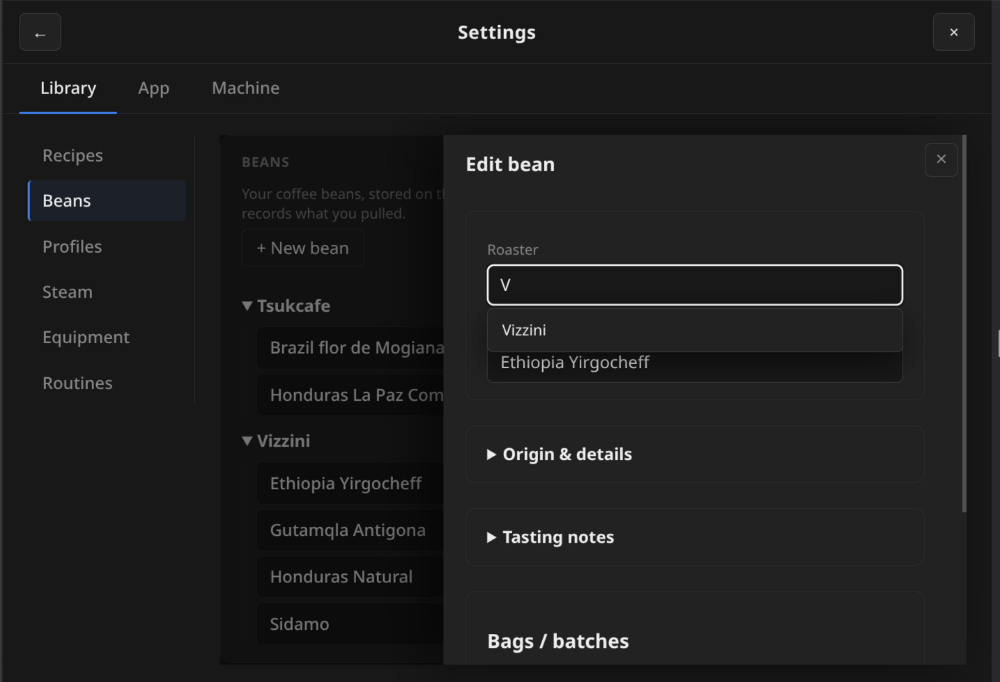
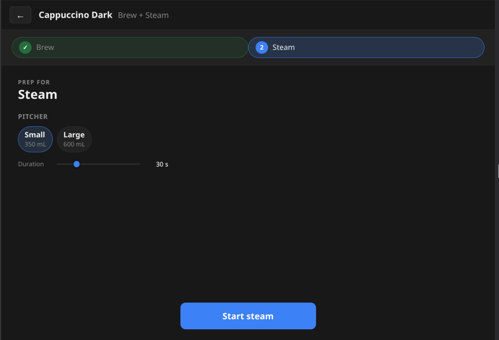
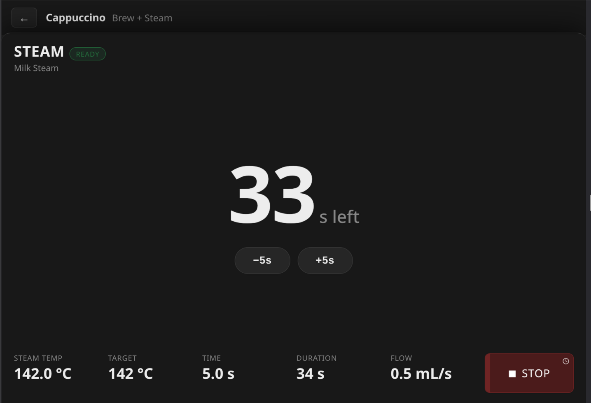
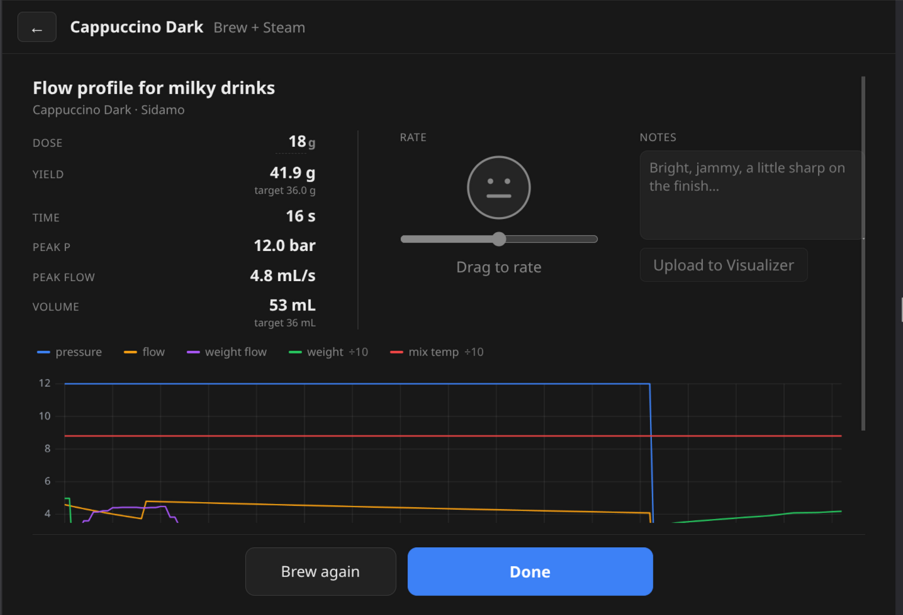

# Getting started with OverDose

## Set up — now and then

As new beans arrive and new drinks earn a spot, you'll add to your library.
It's quick, and you only touch it when something's new.

**Log a new bag — Beans.**

When a fresh bag arrives, add it: roaster and name to start, then as much
origin, process and tasting detail as you like. As you type, each field
**suggests values you've entered before** — tap one from the list instead of
retyping it — so logging is quick and the same roaster stays spelled the same
way.

**Turn it into a recipe.**

Each coffee — or a new drink you want on tap — becomes a recipe: the whole thing
in one place, profile, bean, dose, grind and yield, plus a milk pitcher for
cappuccinos. Dial it in and it's saved, ready to brew with a tap.

## Every day

**Start at Home.**

Your recipes are one tap away, with the machine's status and your last shot on
the right. Pick the drink you want.

**Prep the shot.**

Based on the recipe, OverDose lays out exactly what's about to happen — the
profile and its curve, the bean, your dose and yield targets. Tweak anything for
just this shot before you commit.

**Pull it.**

Hit Start and watch pressure, flow and weight live. The shot stops itself at
your target weight — you just watch it land.

**Steam, when you're ready.**

For a cappuccino the shot is only step one — and the next step waits for you.
Swap the cup and grab the jug, then start steaming when you're ready. It runs
for the pitcher's set duration (adjust it here, or steam untimed).

**Texture the milk.**

Temperature and timing on screen as you steam, with the pitcher's settings
already dialed in from the recipe.

**Done — and remembered.**

A summary of the shot you just pulled: rate it, jot a note, and it's saved with
the bean you used. Back to Home for the next one.
